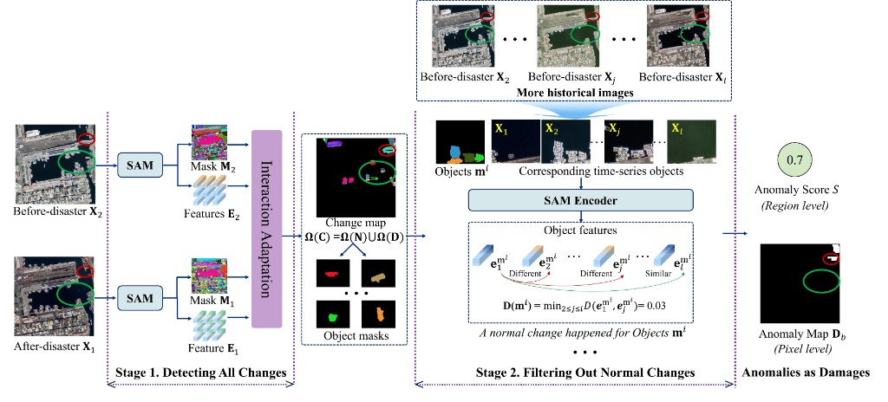
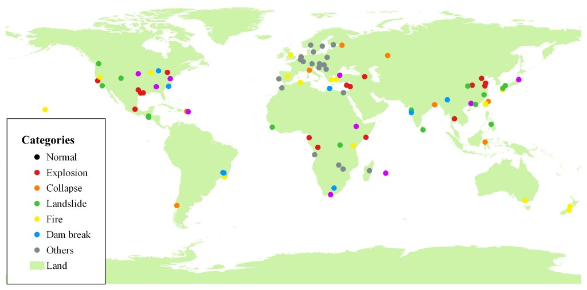

# AnomalyCD

AnomalyCD is a **two-stage anomaly change detection** framework for multi-temporal remote sensing imagery. It first performs bitemporal change detection with SAM (Segment Anything Model), then distinguishes **normal changes** from **anomalous changes** using historical normal observations.

This repository provides a self-contained implementation for inference and evaluation. Core dependencies (SAM and GeoTIFF I/O utilities) are bundled locally, so no external project paths need to be configured.

---

## Overview

AnomalyCD follows a two-stage pipeline:

| Stage | Script | Description |
|-------|--------|-------------|
| **Stage 1** | `run_stage1.py` | Detect pixel-level changes between the latest normal image and the anomaly image |
| **Stage 2** | `run_stage2.py` | Identify anomalous changes using all normal temporal images and Stage 1 outputs |
| **Evaluation** | `run_eval.py` | Per-event recall, precision, and F1 for Stage 1 and Stage 2 |



**Stage 1 — Candidate Change Detection**

1. Feed the latest normal image and the anomaly image into SAM.
2. Generate object masks and image-encoder feature maps for both images.
3. Compare features within SAM segments and produce a continuous change map.

**Stage 2 — Anomaly Identification**

1. Load the Stage 1 change map and all normal temporal images together with the anomaly image.
2. Extract SAM features for each temporal observation over changed regions.
3. Measure temporal feature dissimilarity relative to the anomaly image and produce the final AnomalyCD map.

---

## GDL Dataset

### Download

The **GDL (Global Disaster Land surface)** dataset can be requested through the following form:

**[Download GDL dataset](https://v.wjx.cn/vm/Qj7A1Ij.aspx#)**

Submit your name, organization, and email to receive download instructions.

### Global Coverage

The dataset covers normal control sites and anomaly events across six major categories worldwide:

| ID | Category | Color in map |
|----|----------|--------------|
| 0 | Normal | Black |
| 1 | Explosion | Red |
| 2 | Collapse | Orange |
| 3 | Landslide | Green |
| 4 | Fire | Yellow |
| 5 | Dam break | Light blue |
| 6 | Others | Grey |

Event folder names are prefixed with the category ID (e.g., `0_` for normal, `1_` for explosion).



### Directory Layout

After downloading and extracting the dataset, each event is stored in its own folder with multi-temporal GeoTIFF files sorted by filename:

```
data/
└── 1_Equatorial_Guinea_Explosion-20210313_30/
    ├── anomaly_20200913.tif          # anomaly image        (term_names[0])
    ├── anomaly_20200913_label.tif    # pixel-wise annotation (term_names[1])
    ├── normal_20040712.tif           # normal temporal image
    ├── normal_20140913.tif
    └── normal_20170913.tif           # latest normal image  (term_names[-1])
```

### File Naming Convention

| Prefix | Meaning |
|--------|---------|
| `anomaly_*` | Anomaly-time remote sensing image |
| `*_label*` | Pixel-wise annotation raster |
| `normal_*` | Historical normal-time images |
| Event folder prefix `0_` | Normal control event (category ID 0) |
| Event folder prefix `1`–`6` | Anomaly event category (see table above) |

### Annotation Format

The label raster is **not a binary map**. Each pixel value encodes a semantic category:

- **`0`**: background
- **Different positive integer values**: different anomalous land-cover / object categories within the scene

Multiple anomaly instances or land-cover types in the same event may therefore carry different label IDs in a single annotation file.

> **Note on evaluation:** For TPR / precision / F1 evaluation, the code converts labels to a binary anomaly mask via `binarize_label()` (value `1` is treated as background; all other positive values are merged into the anomaly class). This follows the original evaluation protocol and does **not** change the multi-class nature of the raw annotations.

---

## Environment Setup

### 1. Install Dependencies

Create a Python 3.7+ environment and install the required packages:

```bash
cd AnomalyCD
pip install -r requirements.txt
```

Or activate the pre-configured **RSAD** conda environment:

```bash
conda activate RSAD
pip install -r requirements.txt
```

Core dependencies:

| Package | Version (tested) | Purpose |
|---------|------------------|---------|
| `numpy` | 1.21.6 | Array operations |
| `torch` / `torchvision` | 1.13.0 / 0.14.0 | SAM inference (CUDA) |
| `opencv-python` | 4.8.0.76 | Image processing |
| `scikit-learn` | 1.0.2 | Evaluation metrics |
| `scikit-image` | 0.19.2 | Morphological post-processing |
| `GDAL` | 3.0.2 | GeoTIFF read/write |
| `tqdm` | 4.65.2 | Progress bars |

> **Note:** PyTorch with CUDA and GDAL are recommended to install via conda when `pip install` fails:
>
> ```bash
> conda install pytorch==1.13.0 torchvision==0.14.0 pytorch-cuda=11.7 -c pytorch -c nvidia
> conda install -c conda-forge gdal=3.0.2
> pip install -r requirements.txt
> ```

### 2. SAM Checkpoint

Download the [SAM ViT-B weights](https://dl.fbaipublicfiles.com/segment_anything/sam_vit_b_01ec64.pth) and set the path in `config.py`:

```python
SAM_CHECKPOINT = "/path/to/sam_vit_b_01ec64.pth"
```

### 3. Data and Output Paths

Update the default paths in `config.py`:

```python
DEFAULT_DATA_ROOT = "/path/to/GDL/data"
DEFAULT_OUTPUT_ROOT = "/path/to/output/AnomalyCD"
```

---

## Repository Structure

```
AnomalyCD/
├── README.md
├── config.py                   # global configuration
├── img_io.py                   # GeoTIFF read/write (GDAL)
├── segment_anything_origin/    # bundled SAM library
├── utils.py                    # shared utilities
├── stage1_analysis.py          # Stage 1 core algorithm
├── stage2_analysis.py          # Stage 2 core algorithm
├── eval_metrics.py             # evaluation metrics
├── run_stage1.py               # Stage 1 entry point
├── run_stage2.py               # Stage 2 entry point
├── run.py                      # full pipeline entry point
├── run_eval.py                 # evaluation entry point
├── quick_test.py               # single-patch quick test
├── requirements.txt            # Python dependencies
└── docs/
    └── images/
        ├── framework.png
        └── dataset_distribution.png
```

---

## Quick Start

```bash
cd AnomalyCD
conda activate RSAD
```

### 1. Quick Test (~30–40 seconds)

Verify SAM weights, CUDA, and data paths before full inference:

```bash
python quick_test.py
```

Expected output: `QUICK TEST PASSED`.

### 2. Full Pipeline

```bash
# Run Stage 1 and Stage 2 sequentially on all events
python run.py --stage all --device cuda:0

# Stage 1 only
python run.py --stage 1 --device cuda:0

# Stage 2 only (requires Stage 1 outputs)
python run.py --stage 2 --device cuda:0

# Single event
python run.py --stage all --device cuda:0 --event "1_Equatorial_Guinea_Explosion-20210313_30"
```

### 3. Stage-wise Execution

**Stage 1 — Change Detection**

```bash
python run_stage1.py --device cuda:0
python run_stage1.py --device cuda:0 --no-skip-existing
python run_stage1.py --device cuda:0 --event "1_Equatorial_Guinea_Explosion-20210313_30"
```

**Stage 2 — Anomaly Change Detection**

```bash
python run_stage2.py --device cuda:0
python run_stage2.py --device cuda:0 --event "1_Equatorial_Guinea_Explosion-20210313_30"
```

### 4. Evaluation

After Stage 2 finishes, run the official evaluation:

```bash
python run_eval.py
```

Each event prints **Stage 1** and **Stage 2** recall, precision, and F1:

```
1_xxx_event_name
  Stage1  recall=0.8500  precision=0.7200  F1=0.7800
  Stage2  recall=0.9100  precision=0.8000  F1=0.8520
```

Save per-event records to CSV:

```bash
python run_eval.py --output-csv eval_records.csv
```

---

## Command-Line Arguments

### `run_stage1.py`

| Argument | Default | Description |
|----------|---------|-------------|
| `--data-root` | `config.DEFAULT_DATA_ROOT` | Dataset root directory |
| `--output-root` | `config.STAGE1_OUTPUT_DIR` | Stage 1 output directory |
| `--device` | `cuda:0` | GPU device |
| `--patch-size` | `2048` | Sliding-window patch size |
| `--event` | all events | Process a single event folder |
| `--no-skip-existing` | — | Re-run events that already have outputs |

### `run_stage2.py`

| Argument | Default | Description |
|----------|---------|-------------|
| `--data-root` | `config.DEFAULT_DATA_ROOT` | Dataset root directory |
| `--stage1-root` | `config.STAGE1_OUTPUT_DIR` | Stage 1 output directory |
| `--output-root` | `config.STAGE2_OUTPUT_DIR` | Stage 2 output directory |
| `--device` | `cuda:0` | GPU device |
| `--event` | all events | Process a single event folder |
| `--skip-existing` | `False` | Skip events with existing `AnomalyCD_map.tif` |

### `run_eval.py`

| Argument | Default | Description |
|----------|---------|-------------|
| `--data-root` | `config.DEFAULT_DATA_ROOT` | Dataset root (for reading labels) |
| `--result-root` | `config.STAGE2_OUTPUT_DIR` | Stage 2 result directory |
| `--max-events` | `80` | Maximum number of events to evaluate |
| `--quantile-threshold` | `0.945` | Quantile threshold for Stage 1 binarization |
| `--stage2-threshold` | `0.08` | Fixed threshold for Stage 2 AnomalyCD binarization |
| `--area-ratio` | `0.0003` | Minimum connected-component area ratio |
| `--background-weight` | `0.1` | Background false-positive weight in precision |
| `--normalize-anomaly-map` | `False` | Apply min-max normalization before thresholding |
| `--output-csv` | — | Save per-event evaluation records |

---

## Outputs

### Stage 1

Directory: `{STAGE1_OUTPUT_DIR}/{event_name}/`

| File | Description |
|------|-------------|
| `change_map_continuous.tif` | Continuous change map |
| `change_map_binary.png` | Binarized preview (quantile 0.9) |

### Stage 2

Directory: `{STAGE2_OUTPUT_DIR}/{event_name}/`

| File | Description |
|------|-------------|
| `change_map_filtered.tif` | Filtered change map (quantile 0.7) |
| `AnomalyCD_map.tif` | Final anomaly change detection map |

### Evaluation

`run_eval.py` prints per-event metrics only:

- **Stage 1**: recall, precision, F1 on `change_map_filtered.tif`
- **Stage 2**: recall, precision, F1 on `AnomalyCD_map.tif`

---

## Hyperparameters

Key settings in `config.py`:

| Parameter | Stage | Default | Description |
|-----------|-------|---------|-------------|
| `STAGE1_PATCH_SIZE` | 1 | 2048 | Sliding-window patch size |
| `STAGE1_CHANGE_QUANTILE` | 1 | 0.9 | Change-map binarization quantile |
| `STAGE1_SAM_PARAMS` | 1 | see config | SAM automatic mask generator settings |
| `STAGE2_CHANGE_MAP_QUANTILE` | 2 | 0.7 | Change-map filtering quantile |
| `STAGE2_MIN_MASK_PIXELS` | 2 | 1500 | Minimum mask pixel count |
| `STAGE2_SAM_PARAMS` | 2 | see config | SAM automatic mask generator settings |
| `EVAL_QUANTILE_THRESH` | Eval | 0.945 | Stage 1 evaluation binarization quantile |
| `EVAL_STAGE2_FIXED_THRESH` | Eval | 0.08 | Stage 2 AnomalyCD fixed binarization threshold |
| `EVAL_AREA_RATIO` | Eval | 0.0003 | Small-region filtering area ratio |
| `EVAL_BACKGROUND_WEIGHT` | Eval | 0.1 | Weighted precision background weight |

Stage 2 automatically selects the patch size: **1024** when the short side is below 2048, otherwise **2048**.

---

## Evaluation Protocol

The evaluation follows the protocol in the original `Eval/compare_tpr_recall_F1_.py`:

1. **Change map (Stage 1)**: binarized by quantile threshold (`0.945`); no morphological post-processing
2. **AnomalyCD map (Stage 2)**: binarized by fixed threshold (`0.08`), then morphologically closed and filtered by small connected components
3. **Recall (TPR)**: fraction of anomaly pixels correctly detected
4. **Precision**: weighted precision with background false positives down-weighted by 0.1
5. **F1**: harmonic mean of recall and precision
6. Normal control events (`0_` prefix) are skipped

---

## Notes

1. **GPU required** for Stage 1 and Stage 2 inference. `run_eval.py` runs on CPU only.
2. **Execution order**: Stage 1 → Stage 2 → Evaluation.
3. **Stage 1 skips existing outputs by default**. Use `--no-skip-existing` to force re-inference.
4. **Runtime**: full inference on high-resolution images (e.g., 9840×13184) can take a long time. Use `quick_test.py` first, then debug with `--event`.
5. **Legacy code** remains in the parent repository:
   - Stage 1: `SAM_Change_Detection/run.py`
   - Stage 2: `SAM_Anomaly_Change/run.py`
   - Evaluation: `Eval/compare_tpr_recall_F1_.py`

---

## End-to-End Example

```bash
# 1. Activate environment
conda activate RSAD
cd AnomalyCD

# 2. Edit data paths and SAM checkpoint in config.py

# 3. Verify setup
python quick_test.py

# 4. Debug on a single event
python run.py --stage all --device cuda:0 --event "1_Equatorial_Guinea_Explosion-20210313_30"

# 5. Full inference
python run.py --stage all --device cuda:0

# 6. Evaluation
python run_eval.py --output-csv eval_records.csv
```
